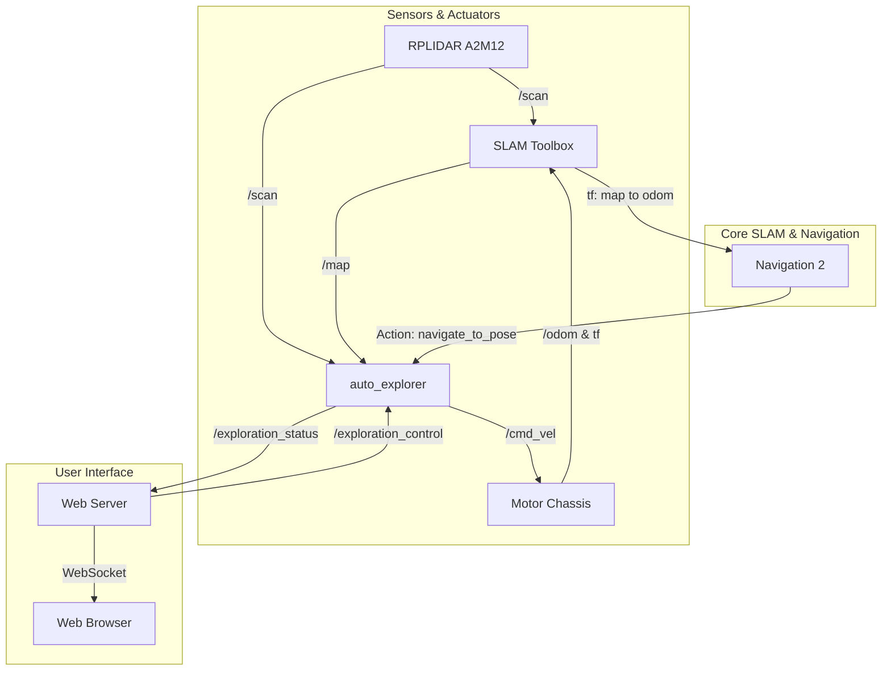
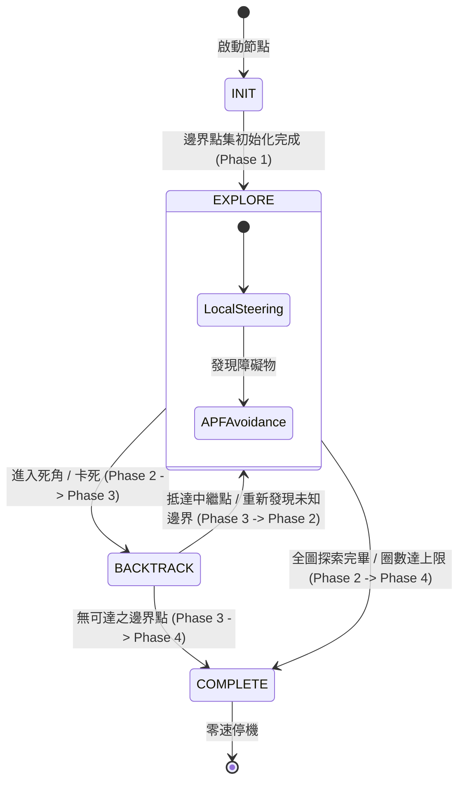

# 🧭 邊界自主探索與避障原理 (Autonomous Exploration Working Principles)

本專案的核心自動化特色是 **自主地圖探索功能 (`auto_explorer` 功能包)**。該功能融合了二維網格地圖處理、邊界特徵擷取、人工勢能場局部避障、以及 Nav2 全域路徑規劃，實作了一套靈活且具備自愈能力的四階段（4-Phase）地圖構建演算法。

---

## 🗺️ 相關文件連結
- **主入口指南**：[Readme.md](Readme.md)
- **Web 介面操作說明**：[web_control_guide.md](web_control_guide.md)
- **參數設定檔指南**：[config_guide.md](config_guide.md)

---

## 1. 系統架構與資料流

`auto_explorer` 節點作為決策核心，在 ROS 2 環境下與其他功能包緊密互動：

---

## 2. 四階段 (4-Phase) 自主探索演算法詳解

演算法的核心思想是：**「局部利用勢能場快速探索，受阻時利用全域導航進行跳脫，並在全圖邊界清除後安全終止。」**

### 🎯 Phase 1: INIT (邊界點集初始化與維護)
- **原理**：演算法定期讀取 `/map` 主題的二維佔用網格地圖（Occupancy Grid）。利用矩陣快速平移演算法，尋找地圖中「自由空間 (0)」與「未知空間 (-1)」交界的核心網格。
- **圖釘機制 (Thumbtack Pool)**：
  - 為了避免處理過於密集的邊界點，演算法會以 `thumbtack_spacing`（預設為 0.5 米）為間距，在邊界群集上灑下「虛擬圖釘」作為前進的候選標記。
  - **實時清理**：隨著機器人移動，雷達將未知區域掃描為自由或障礙物時，該區域內的圖釘便會自動被剔除，確保圖釘池始終代表當前的邊界。

### 🏎️ Phase 2: EXPLORE (局部勢能引導與 APF 避障)
在局部探索模式下，機器人依據雷達資料與目標引導，進行無人干預的避障移動。
1. **扇區權重計算 (Sector Weighting)**：
   - 機器人將周圍 360 度劃分為多個扇區。
   - 權重計算公式結合了該扇區朝向與**最鄰近邊界圖釘的夾角**（夾角越小，引導權重越高）以及**雷達障礙物距離**。
2. **目標鎖定與滯後機制 (Hysteresis)**：
   - 為了防止機器人在多個邊界點之間反覆擺動（Oscillation），引入了 `hysteresis_factor` 與 `sector_lock_cycles`。一旦機器人鎖定某個前進方向，會強制保持一定週期，直到其他方向的權重顯著大於當前方向。
3. **人工勢能場 (Artificial Potential Field, APF) 避障**：
   - 邊界圖釘產生**引力**（Attractive Force），引導機器人前進。
   - 雷達掃描到的障礙物產生**斥力**（Repulsive Force），距離小於 `obstacle_safety_dist` 時斥力逐漸增加。
   - 引力與斥力的合力向量被轉換為 `linear.x` 與 `angular.z` 速度指令，使機器人能平滑地繞過牆角。

### 🔄 Phase 3: BACKTRACK (全域導航回溯跳脫)
當機器人進入狹窄的死胡同、所有局部扇區皆被障礙物阻擋（權重為 0），或者因打滑等物理原因卡死時，會觸發回溯機制。
- **卡死判定**：
  - **物理卡死**：在 3 秒內移動距離小於 0.15 米，導致「卡死溫度 (Stuck Temp)」上升並超過 `stuck_temp_threshold`。
  - **演算法死角**：地圖上所有局部扇區的引導權重均為 0。
- **Nav2 整合回溯**：
  - 節點會呼叫 ROS 2 **Navigation 2** (`NavigateToPose` 動作服務)，規劃一條穿越已知安全區域的全域避障路徑，前往距離目前最合理、且未被列入黑名單的遠端圖釘（Thumbtack）。
- **交接與防卡死黑名單**：
  - 當機器人接近該回溯點（小於 `min_dist_to_target`），或者在路上雷達重新偵測到未知的邊界時，會主動中斷 Nav2 任務，將控制權交還給 Phase 2 繼續進行局部勢能探索。
  - 若多次前往同一個圖釘失敗，會將其加入**黑名單**，避免重複卡死。

### ⏹️ Phase 4: COMPLETE (終止與安全停機)
- **觸發條件**：
  - 圖釘池中的有效邊界點歸零（代表地圖已完全閉合，無未知區域）。
  - 所有殘留的邊界點皆處於無法抵達的黑名單中。
  - 探索的圈數（Lap）達到了 `max_exploration_laps` 的上限。
- **行為**：
  - 主動向 `/cmd_vel` 發送零速指令，將狀態標記為 `COMPLETE` 並停止定時器，確保機器人靜止安全。

---

## 3. SLAM 建圖與座標系轉換說明

自主探索的成功建立在穩定的 **SLAM 建圖系統 (`wheeltec_slam_toolbox`)** 之上：

1. **里程計與雷達融合**：
   - 雷達發布點雲 `/scan`，底盤發布里程計數據 `/odom`。
   - SLAM 節點利用掃描配對 (Scan Matching) 與迴圈閉合 (Loop Closure) 技術，建立地圖座標系 (`map`) 與里程計座標系 (`odom`) 之間的轉換關係。
2. **座標變換樹 (TF Tree)**：
   - 系統的核心變換為：`map -> odom -> base_footprint -> base_link`。
   - `auto_explorer` 藉由監聽 `map -> base_link` 的 TF 變換，即時計算機器人在世界座標系下的 `(X, Y, Yaw)`。
